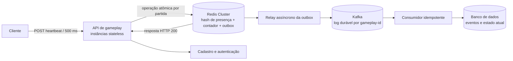

# Jogo de senha — V1 (MVP)

## 1. Jogo

- Cada partida tem dois jogadores cadastrados. Cada um escolhe uma senha de quatro algarismos distintos, de 0 a 9.
- Os jogadores alternam palpites de quatro algarismos. O servidor retorna a quantidade de **corretos** (algarismo e posição iguais) e **parciais** (algarismo presente em outra posição).
- O autor recebe o feedback; o adversário recebe o palpite e o mesmo feedback. A partida termina quando todos os algarismos forem acertados nas posições corretas.

## 2. Heartbeat da V1

O cliente envia um `POST /gameplay/{gameplay-id}/{player-id}` a cada **500 ms**. O servidor grava o instante de recebimento com precisão de milissegundos e retorna HTTP 200 com o estado da partida.

No Redis:

- `{{gameplay-id}}|bit`: hash com `player-id → timestamp do último heartbeat`.
- `{{gameplay-id}}|timeout`: contador inteiro, inicializado em `0`.

Após atualizar o timestamp do jogador que chamou o endpoint, a regra especificada é:

1. Se **algum jogador** tiver o último heartbeat há mais de 5 segundos, definir `timeout = 0`.
2. Caso contrário, se `timeout < 3`, responder `{"updated-at":"<timestamp>","gameplay-online":true,"suspended":false}` e incrementar `timeout` em 1.
3. Caso contrário (`timeout >= 3`), responder `{"updated-at":"<timestamp>","gameplay-online":false,"suspended":true}` e apagar as chaves `{{gameplay-id}}|bit` e `{{gameplay-id}}|timeout`.

`updated-at` é o instante gravado para o jogador que enviou aquele heartbeat.

> **Atenção: a condição, como escrita, parece invertida.** Se algum jogador estiver sem heartbeat há mais de 5 segundos, o contador é zerado; se nenhum estiver atrasado, o contador cresce e a partida é suspensa após três chamadas. Como o endpoint é chamado a cada 500 ms, isso pode suspender uma partida com ambos conectados em cerca de 1,5 segundo. A regra foi registrada sem alteração; convém confirmar se a intenção era incrementar o contador quando o oponente estiver atrasado.

## 3. Desenho da arquitetura

## 4. Componentes e confiabilidade

- **API stateless:** valida usuário, partida e jogador; pode rodar em várias instâncias. Não usa WebSocket; cada heartbeat recebe sua própria resposta HTTP.
- **Redis Cluster:** contém o estado de presença usado para a resposta rápida. Atualizar o hash, avaliar o timeout, alterar o contador, remover chaves quando aplicável e registrar o evento na outbox deve ser uma única operação atômica por partida.
- **Outbox, Kafka e consumidor:** a outbox registra cada heartbeat/alteração de estado junto com a operação Redis. O relay publica os eventos no Kafka, particionados por `gameplay-id`; o consumidor persiste-os no banco. Reentregas são deduplicadas por ID de evento, tornando a gravação idempotente.
- **Banco de dados:** conserva os heartbeats e transições de estado para recuperação e auditoria. O estado atual pode ser reconstruído no Redis a partir do registro persistido.

Em Redis Cluster, as chaves da mesma partida precisam cair no mesmo slot para a operação atômica. Portanto, mantenha a convenção lógica acima e use uma *hash tag* comum baseada no `gameplay-id` nas chaves físicas, incluindo a outbox. Configure persistência e replicação do Redis e retenha eventos da outbox até confirmação de publicação/processamento.

**Estado suspenso:** como a regra apaga as duas chaves ao suspender, o estado final precisa ser preservado no banco (e consultado em chamadas seguintes) para que um novo heartbeat não recrie a presença e reative acidentalmente a partida.
