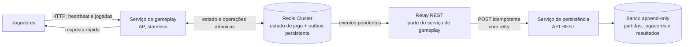

# Jogo de senha — V2 do MVP

## 1. Objetivo e regras herdadas

A V2 mantém as regras do jogo e o heartbeat descritos na [V1](./arquitetura-backend-v1.md). A mudança é a persistência: **não há Kafka**; o serviço de gameplay envia os dados ao serviço de persistência por chamadas REST.

## 2. Desenho da arquitetura

## 3. Responsabilidades

- **Serviço de gameplay:** valida jogadores e palpites, calcula corretos/parciais, retorna feedback e mantém o estado ativo no Redis. A operação por partida é atômica e funciona em múltiplas instâncias. Para priorizar disponibilidade, responde sem esperar a gravação no banco.
- **Outbox e relay REST:** cada mudança relevante — incluindo heartbeats, conforme o requisito de persistir todas as informações — é registrada atomicamente junto à atualização do Redis. O relay envia os eventos por REST e tenta novamente em caso de falha; só marca um evento como entregue após confirmação do serviço de persistência.
- **Serviço de persistência:** recebe eventos autenticados por REST e grava partidas, jogadores, palpites, feedbacks e resultados no banco. Não altera nem apaga registros anteriores.
- **Banco append-only:** conserva o histórico imutável. Cada evento recebe um identificador único e uma sequência crescente por partida. Reenvios são idempotentes; registros fora de ordem não substituem um estado mais recente. A visão atual da partida é o último registro válido pela sequência.

## 4. Disponibilidade, consistência e CAP

- O serviço de gameplay é desenhado para **priorizar disponibilidade e tolerância a partições (AP)**: se o serviço de persistência estiver inacessível, continua o jogo e mantém as gravações pendentes na outbox para reenviar depois.
- A persistência mantém **consistência** com gravações idempotentes e ordenadas por partida. O serviço de banco pode estar disponível normalmente, mas, diante de uma partição que impeça validar ou gravar com segurança, deve rejeitar/adiar a gravação — escolhendo consistência em vez de disponibilidade naquele momento.
- **Ressalva do CAP:** não é possível garantir simultaneamente Consistência e Disponibilidade durante uma partição. Portanto, o serviço de persistência não pode ser “CA” em todos os cenários distribuídos; o desenho acima é **AP para o gameplay** e **CP para gravações consistentes** quando há partição. A outbox faz a convergência quando a conexão volta.

## 5. Garantias e limites

- O Redis deve manter estado e outbox duráveis (persistência em disco e replicação); eventos só são removidos após confirmação REST. O banco é a fonte do histórico confiável; o Redis é a fonte rápida do estado ativo.
- O serviço de persistência autentica o serviço chamador e deduplica pelo identificador do evento. A sequência por partida impede que retries atrasados façam uma versão antiga parecer atual.
- Com heartbeats a cada 500 ms dos dois jogadores, persistir cada heartbeat gera até **4 eventos por partida por segundo**. Esse volume deve ser considerado no dimensionamento; a regra da V1 para o contador de timeout permanece como descrita lá e ainda requer confirmação, pois seu comportamento parece invertido.
