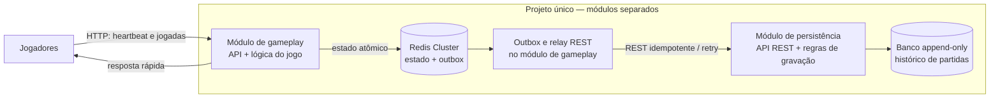

# Jogo de senha — V3 do MVP

## 1. Mudança desta versão

A V3 mantém as regras de jogo, heartbeat, cache, outbox e persistência REST da [V2](./arquitetura-backend-v2-mvp.md). A mudança é de organização: os dois serviços passam a ser **módulos diferentes do mesmo projeto**. Podem ser compilados e executados juntos ou como serviços separados; em ambos os modos, a comunicação entre módulos permanece REST.

## 2. Desenho

## 3. Módulos e execução

- **Gameplay:** valida jogadores e palpites, calcula feedback e gerencia o estado ativo no Redis. Continua respondendo aos jogadores sem esperar a gravação do banco; eventos pendentes são reenviados pelo relay REST.
- **Persistência:** recebe eventos REST autenticados, deduplica por ID, respeita a sequência por partida e grava histórico imutável. A versão mais recente válida representa o estado atual.
- **Compilação conjunta:** um único artefato hospeda os dois módulos. As chamadas REST continuam passando pelas interfaces HTTP definidas, mesmo que a comunicação seja local ao processo.
- **Compilação separada:** cada módulo vira um serviço implantável separadamente e as mesmas chamadas REST passam pela rede. Permite escalar e implantar os módulos de forma independente.

A escolha de compilação não muda os contratos REST, a outbox, o modelo append-only nem as responsabilidades dos módulos. Muda a topologia operacional: no modo separado há uma fronteira de rede entre módulos; no conjunto, os módulos compartilham processo e ciclo de implantação.

## 4. CAP: ressalva importante

A organização em um projeto ou em dois artefatos **não altera o teorema CAP**. O módulo de gameplay pode priorizar disponibilidade e tolerância a partições (**AP**), continuando o jogo e mantendo eventos pendentes quando a persistência não responde.

Já “Consistência e Disponibilidade (CA)” só descreve o serviço de persistência enquanto não há partição que afete suas dependências. Em uma partição, não é possível garantir simultaneamente consistência e disponibilidade: para preservar consistência, a persistência deve rejeitar ou adiar gravações que não possa validar com segurança (**CP naquele cenário**). A outbox envia os eventos novamente quando a comunicação é restabelecida.

> **Resumo:** um projeto, dois módulos; compilação conjunta ou separada; comunicação REST em ambos; gameplay prioriza AP; persistência prioriza consistência e não pode prometer CA durante partições.
