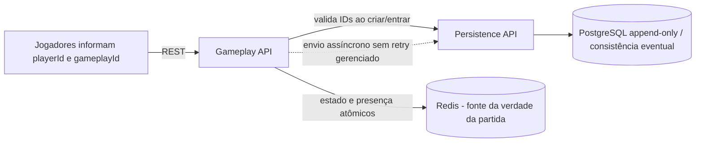

# Jogo de senha — documentação final do MVP

## 1. Regras do jogo

- A partida envolve dois jogadores já cadastrados. Para entrar, cada pessoa informa seu `playerId`; o segundo jogador também informa o `gameplayId` recebido de quem criou a partida.
- Cada jogador define secretamente uma senha de quatro algarismos distintos, de 0 a 9.
- Os jogadores alternam palpites pela interface. O servidor calcula **corretos** (algarismo e posição iguais) e **parciais** (algarismo presente em outra posição) e registra palpites e resultados no estado da partida.
- O backend calcula o resultado de cada palpite, mas o controle de turnos concorrentes é responsabilidade do frontend nesta MVP.
- A partida termina quando um jogador acerta os quatro algarismos nas posições corretas ou quando ocorre timeout de presença.

## 2. Identificação e entrada na partida

- A MVP não implementa login, sessão ou tokens. Os jogadores digitam os IDs de usuário já cadastrados; o backend valida se eles existem no início da partida/entrada.
- Um jogador cria a partida e compartilha o `gameplayId` com o oponente por um meio externo ao sistema. O oponente entra informando seu `playerId` e o `gameplayId`.
- Não há fluxo de convite/notificação que exija aceite síncrono do oponente. O estado da partida registra a entrada ou recusa quando aplicável.
- Sem autenticação, um ID digitado não prova a identidade de quem o controla. Essa limitação é conhecida e aceita como débito técnico da MVP.

## 3. Gameplay, cache e heartbeat

- O Redis é a **fonte da verdade durante a gameplay**; o banco não é consultado para responder a ações ou consultas da partida ativa.
- Para cada partida há duas chaves: uma para presença/heartbeat e timeout; outra para o estado acumulativo da partida, incluindo jogadores, aceite/recusa, senhas, palpites e resultados. As alterações relevantes são atômicas por partida. Partidas diferentes usam chaves independentes.
- Cada jogador envia um heartbeat a cada **1 segundo**. Após atualizar o timestamp recebido, o backend verifica os timestamps dos dois jogadores. Se qualquer jogador ficar sem heartbeat por mais de **5 segundos**, a partida termina por timeout.
- A inicialização exata do relógio de timeout, antes do primeiro heartbeat de cada participante, deve usar o instante de ativação da partida como referência.

## 4. Persistência e consistência

- O cache guarda o último estado corrente da partida e a lista acumulativa de palpites/resultados. O PostgreSQL é append-only e recebe, de forma assíncrona, atualizações de estado geradas pelo Gameplay.
- Durante a gameplay, a API não lê o banco para obter o estado. A consistência entre Redis e PostgreSQL é eventual; o conteúdo do Redis prevalece para a partida ativa.
- A MVP não implementa idempotência ponta a ponta, ordenação por sequência monotônica, replay nem recuperação de uma partida perdida no Redis.
- A escrita assíncrona não gerencia tamanho da fila, polling ou retry. A latência do serviço de Persistência não bloqueia a thread de gameplay, mas falhas podem atrasar ou perder atualizações históricas.

## 5. Arquitetura proposta

- **Gameplay:** controla criação/entrada, aceite/recusa quando aplicável, senhas, palpites, resultados, presença e encerramento. O estado em Redis é o estado autoritativo da partida ativa.
- **Persistência:** valida a existência dos IDs na inicialização/entrada, conforme necessário, e recebe atualizações assíncronas para histórico append-only.
- A tecnologia de execução e os parâmetros de alta disponibilidade do Redis, assim como mecanismo durável de fila, não são garantidos nesta MVP. Aceita-se o risco de perda de estado se o Redis falhar.

## 6. Limites e débitos técnicos reconhecidos

A análise completa está em [Problemas possíveis e mitigações](./tech-docs/riscos-e-mitigacoes-mvp.md). Principais débitos:

- Sem autenticação, sessão ou autorização confiável por identidade; IDs podem ser falsificados.
- Sem retry gerenciado, limite/tamanho de fila nem garantia de entrega do processamento assíncrono ao banco.
- Sem idempotência ponta a ponta; ordenação histórica depende dos timestamps emitidos por Gameplay.
- Perda de estado em falha do Redis é aceita; não há replay/recuperação de partidas.
- Turnos e concorrência entre palpites são controlados pelo frontend, não pelo backend.
- Observabilidade limitada aos logs da aplicação; sem objetivos operacionais, circuit breaker, retry/fallback abrangente ou testes de carga/falha na MVP.
- Crescimento do estado acumulativo em uma única chave por partida e capacidade do PostgreSQL ficam para evolução futura.

## 7. Escopo de testes e execução

A MVP prevê testes unitários e integrados. Testes de carga, failover, recuperação, métricas operacionais e metas de SLO/RTO/RPO ficam fora do escopo inicial e são débitos técnicos.

Este repositório contém documentação e proposta de arquitetura; o código da aplicação ainda não foi criado. Veja a [especificação técnica](./tech-docs/arquitetura-tecnica-mvp.md) para contratos HTTP e modelos de dados.
