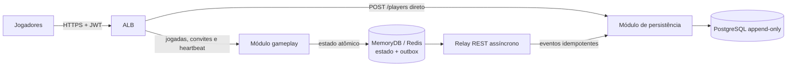

# Jogo de senha — documentação final do MVP

## 1. Regras do jogo

- Cada partida envolve dois jogadores cadastrados. Cada um escolhe secretamente quatro algarismos distintos de 0 a 9.
- Após o convite ser aceito e ambos definirem suas senhas, os jogadores alternam palpites de quatro algarismos.
- O serviço retorna **corretos** (algarismo e posição iguais) e **parciais** (algarismo presente em outra posição). O autor recebe o feedback; o adversário recebe o palpite e a mesma contagem.
- A partida termina quando um jogador acerta os quatro algarismos nas posições corretas.

## 2. Cadastro e convite

- O jogador se cadastra **uma única vez**, diretamente no módulo de persistência. A identidade autenticada é única; tentativas repetidas retornam o mesmo perfil.
- Um jogador abre uma partida direcionada a outro pelo `playerId`. A partida começa com status `PENDING`.
- O jogador convidado pode aceitar (`ACCEPTED`) ou recusar (`DECLINED`). Após o aceite, ambos definem suas senhas; com as duas senhas definidas, a partida passa a `ACTIVE`.
- Gameplay valida o convidado e gerencia a abertura, decisão e estado corrente da partida no Redis. Convites e atualizações são consultados por polling REST, sem WebSocket.

## 3. Heartbeat e presença

O cliente envia `PATCH /games/{gameplayId}/presence` a cada **500 ms**, sem corpo; o serviço grava o horário de recebimento com precisão de milissegundos e retorna o estado conforme o contrato da [documentação técnica](./tech-docs/arquitetura-tecnica-mvp.md).

No Redis, por partida:

- `{{gameplay-id}}|bit`: hash `player-id → horário do último heartbeat`.
- `{{gameplay-id}}|timeout`: contador, inicialmente `0`.

Regra recebida após atualizar o heartbeat do chamador:

1. Se algum jogador tiver o último heartbeat há mais de 5 segundos, definir `timeout = 0`.
2. Caso contrário, se `timeout < 3`, retornar `{"updated-at":"<horário salvo>","gameplay-online":true,"suspended":false}` e incrementar o contador.
3. Caso contrário, retornar `{"updated-at":"<horário salvo>","gameplay-online":false,"suspended":true}` e apagar as chaves de presença e timeout.

> **Ponto a confirmar:** a condição parece invertida. Como escrita, zera o contador quando alguém está atrasado e o incrementa quando ambos estão online, podendo suspender uma partida ativa após três chamadas (cerca de 1,5 s). Também não foi definido o payload do ramo que zera o contador. A regra fica pendente de confirmação antes da implementação.

## 4. Arquitetura e persistência

- **Gameplay:** controla partidas, convites, aceite/recusa, senhas, palpites, presença e resultado no estado ativo do Redis. Cada transição é atômica por partida.
- **Persistência:** recebe diretamente o cadastro de jogadores e grava o histórico imutável das partidas. A outbox do gameplay replica assincronamente abertura, aceite/recusa, estado, senhas, palpites, feedbacks, heartbeats e encerramento por REST. Não há Kafka.
- **Banco:** guarda jogadores sem duplicação e registros append-only. Cada evento tem `eventId` idempotente e sequência crescente por partida; o último registro válido define a visão atual. Eventos antigos não são alterados nem apagados.
- **Resiliência:** quando o banco não responde, gameplay continua com estado/outbox em Redis e reenvia eventos depois. O estado final da partida deve permanecer consultável mesmo após apagar chaves temporárias de presença.

## 5. Projeto e implantação

Os módulos pertencem a um projeto Java 21/Spring Boot e podem ser compilados/implantados juntos ou separados; a comunicação permanece REST. Stack escolhida: AWS ECS/Fargate, ALB, MemoryDB compatível com Redis OSS, RDS PostgreSQL Multi-AZ, Cognito, Secrets Manager/KMS e CloudWatch.

Gameplay prioriza disponibilidade frente a falhas do serviço de persistência; a persistência prioriza consistência. Pelo CAP, não se promete Consistência e Disponibilidade simultâneas durante partições: eventos pendentes são reenviados quando a conectividade volta. A especificação detalhada está em [Documentação técnica](./tech-docs/arquitetura-tecnica-mvp.md).
