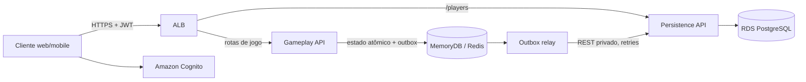

# MVP do jogo de senha — especificação técnica

Todas as rotas públicas abaixo exigem JWT válido do Amazon Cognito. O jogador que executa a ação é identificado pelo `sub` autenticado; não se aceita um `playerId` arbitrário como identidade do autor. As rotas `/internal` são privadas e exigem autenticação entre serviços.

**Formato comum:** JSON em UTF-8 (`Content-Type: application/json`) quando houver corpo. Datas e horários usam ISO 8601 UTC. Senhas e palpites são strings de exatamente quatro algarismos, para preservar zeros à esquerda, e contêm algarismos distintos de 0 a 9.

**Erros:** as respostas de erro usam `{ "code": "...", "message": "...", "traceId": "..." }`. Códigos HTTP esperados: `400` entrada inválida, `401` não autenticado, `403` sem autorização para a partida, `404` recurso inexistente, `409` conflito com o estado atual e `503` indisponibilidade temporária. Segredos nunca são incluídos em respostas destinadas ao oponente nem em logs.

## 1. Gameplay

### Responsabilidade e arquitetura

Gameplay é responsável por convites, decisões, senhas, turnos, palpites, feedback, presença e transições da partida. Mantém o estado operacional no MemoryDB compatível com Redis e responde ao jogador sem esperar a persistência assíncrona. Cada transição valida o estado anterior e atualiza estado, sequência e outbox atomicamente.

**Stack proposta:** Java 21, Spring Boot 3 e Gradle multi-módulo. Gameplay e Persistência podem ser empacotados juntos ou executados como serviços separados, sem alterar os contratos REST.



### Contratos HTTP de Gameplay

| Método e endpoint | Entrada | Saída de sucesso |
|---|---|---|
| `POST /games/invitations` | JSON: `inviteePlayerId` | `201 Created`: convite criado como `PENDING`, incluindo `gameplayId` |
| `GET /games/invitations?status=PENDING` | Sem corpo; filtro opcional `status` | `200 OK`: lista de convites visíveis ao jogador autenticado |
| `PATCH /games/{gameplayId}/accept` | Sem corpo | `200 OK`: estado atualizado para `ACCEPTED` |
| `PATCH /games/{gameplayId}/decline` | Sem corpo | `200 OK`: estado atualizado para `DECLINED` |
| `PUT /games/{gameplayId}/secret` | JSON: `digits` | `200 OK`: confirmação de senha definida e estado atual da partida, sem devolver a senha |
| `PATCH /games/{gameplayId}/presence` | Sem corpo; o servidor registra o horário de recebimento | `200 OK`: horário registrado, estado online e eventual suspensão |
| `PUT /games/{gameplayId}/guess` | JSON: `requestId` e `digits` | `200 OK`: confirmação do palpite e feedback de corretos/parciais |
| `GET /games/{gameplayId}/updates?afterSequence={n}` | Sem corpo; cursor opcional `afterSequence` (padrão `0`) | `200 OK`: eventos visíveis posteriores ao cursor e próximo cursor |
| `GET /games/{gameplayId}/state` | Sem corpo | `200 OK`: estado visível da partida para o jogador autenticado |

#### Abrir convite — `POST /games/invitations`

Entrada:

```json
{
  "inviteePlayerId": "player-456"
}
```

Saída (`201 Created`):

```json
{
  "gameplayId": "game-123",
  "status": "PENDING",
  "inviterPlayerId": "player-123",
  "inviteePlayerId": "player-456",
  "createdAt": "2026-10-05T14:30:00Z"
}
```

Gameplay confirma que o jogador convidado existe por meio do módulo de Persistência. Um alvo inexistente resulta em `404`; não se cria a partida.

#### Consultar convites — `GET /games/invitations?status=PENDING`

Entrada: sem corpo. `status` é um filtro opcional; se omitido, a API usa `PENDING`.

Saída (`200 OK`):

```json
{
  "items": [
    {
      "gameplayId": "game-123",
      "status": "PENDING",
      "inviterPlayerId": "player-123",
      "inviteePlayerId": "player-456",
      "createdAt": "2026-10-05T14:30:00Z"
    }
  ]
}
```

A lista inclui apenas partidas das quais o jogador autenticado participa e que correspondem ao filtro.

#### Aceitar ou recusar — `PATCH /games/{gameplayId}/accept` e `PATCH /games/{gameplayId}/decline`

Ambas as operações não recebem corpo. Somente o convidado designado pode decidir enquanto o convite estiver `PENDING`. A transição é atômica; repetir a mesma decisão retorna o estado atual, e tentar a decisão oposta após a primeira decisão retorna `409 Conflict`.

Saída de `PATCH /games/{gameplayId}/accept` (`200 OK`):

```json
{
  "gameplayId": "game-123",
  "status": "ACCEPTED",
  "updatedAt": "2026-10-05T14:31:00Z"
}
```

Saída de `PATCH /games/{gameplayId}/decline` (`200 OK`):

```json
{
  "gameplayId": "game-123",
  "status": "DECLINED",
  "updatedAt": "2026-10-05T14:31:00Z"
}
```

#### Definir ou atualizar senha — `PUT /games/{gameplayId}/secret`

Entrada:

```json
{
  "digits": "4820"
}
```

Saída (`200 OK`):

```json
{
  "gameplayId": "game-123",
  "status": "ACCEPTED",
  "ownSecretSet": true,
  "bothSecretsSet": false
}
```

A resposta pode trazer `status: "ACTIVE"` e `bothSecretsSet: true` quando os dois jogadores já definiram suas senhas. A senha não é devolvida na resposta. A rota substitui a senha do próprio jogador; a autenticação e a participação na partida são validadas.

#### Heartbeat / presença — `PATCH /games/{gameplayId}/presence`

Entrada: sem corpo. O horário é gerado pelo servidor no recebimento, com precisão de milissegundos. O cliente envia esta chamada a cada 500 ms enquanto estiver conectado.

Saída (`200 OK`):

```json
{
  "gameplayId": "game-123",
  "updatedAt": "2026-10-05T14:31:00.123Z",
  "gameplayOnline": true,
  "suspended": false
}
```

O contrato mantém os mesmos campos quando a partida é suspensa (`gameplayOnline: false`, `suspended: true`). O estado terminal/suspenso permanece consultável mesmo que as chaves temporárias de presença sejam removidas.

> **Regra de timeout pendente de confirmação:** a regra recebida zera o contador quando algum jogador está sem heartbeat há mais de 5 segundos, mas o incrementa quando nenhum está atrasado. Aplicada literalmente, pode suspender uma partida online após três chamadas e não contar a ausência. A especificação do payload agora é uniforme, mas a lógica de negócio do timeout ainda precisa ser confirmada antes da implementação.

#### Enviar palpite — `PUT /games/{gameplayId}/guess`

Entrada:

```json
{
  "requestId": "c0f3b9e8-7a5d-4c10-a765-123456789abc",
  "digits": "1234"
}
```

Saída (`200 OK`):

```json
{
  "gameplayId": "game-123",
  "requestId": "c0f3b9e8-7a5d-4c10-a765-123456789abc",
  "sequence": 17,
  "status": "ACTIVE",
  "result": {
    "correct": 1,
    "partial": 2
  },
  "createdAt": "2026-10-05T14:32:00Z"
}
```

O servidor valida que a partida está `ACTIVE`, que é a vez do jogador autenticado e que o palpite contém quatro algarismos distintos. `requestId` é obrigatório para deduplicar retries: repetir o mesmo identificador e conteúdo devolve o resultado já calculado sem registrar uma segunda jogada; reutilizá-lo com conteúdo diferente resulta em `409 Conflict`. O feedback informa somente as contagens, nunca a senha.

#### Consultar atualizações — `GET /games/{gameplayId}/updates?afterSequence={n}`

Entrada: sem corpo. `afterSequence` é um cursor numérico não negativo; o padrão é `0`.

Saída (`200 OK`):

```json
{
  "items": [
    {
      "sequence": 17,
      "type": "GUESS",
      "playerId": "player-456",
      "digits": "1234",
      "result": {
        "correct": 1,
        "partial": 2
      },
      "createdAt": "2026-10-05T14:32:00Z"
    }
  ],
  "nextSequence": 17
}
```

Retorna apenas palpites e feedbacks que o jogador autenticado pode ver, em ordem crescente de sequência. Não inclui senhas.

#### Consultar estado — `GET /games/{gameplayId}/state`

Entrada: sem corpo.

Saída (`200 OK`):

```json
{
  "gameplayId": "game-123",
  "status": "ACTIVE",
  "players": ["player-123", "player-456"],
  "currentTurnPlayerId": "player-123",
  "ownSecretSet": true,
  "opponentSecretSet": true,
  "gameplayOnline": true,
  "suspended": false,
  "lastSequence": 17
}
```

A resposta é filtrada conforme o participante autenticado. Não expõe nenhuma senha, inclusive a senha do próprio jogador; a partida pode ser retomada consultando este recurso e `/updates`.

### Ciclo, estado e classes de Gameplay

Estados principais: `PENDING`, `ACCEPTED`, `DECLINED`, `ACTIVE`, `SUSPENDED` e `FINISHED`. O estado só passa a `ACTIVE` após aceite e definição das duas senhas. Recusa, suspensão e encerramento não apagam o histórico.

Chaves por partida, usando uma *hash tag* comum no Redis Cluster:

- `{gameplayId}:state`: participantes, status, turno, senhas protegidas, palpites e resultado.
- `{gameplayId}:presence`: hash `playerId → lastSeenEpochMillis`.
- `{gameplayId}:timeout`: contador de tolerância.
- `{gameplayId}:sequence`: sequência monotônica dos eventos.
- `{gameplayId}:outbox`: Redis Stream com eventos ainda não confirmados pela Persistência.

Cada mudança valida o estado anterior e atualiza estado, sequência e outbox atomicamente (script Lua ou transação Redis). Isso evita aceitar, por exemplo, aceite e recusa simultâneos para o mesmo convite.

Classes principais: `GameplayController`; `InvitationApplicationService`; `GameLifecycleService`; `RegisteredPlayerClient`; `HeartbeatApplicationService` / `PresencePolicy`; `GuessApplicationService` / `GuessEvaluator`; `RedisGameRepository`; `OutboxRelay` / `PersistenceRestClient`; `GameRecoveryService`.

## 2. Persistência

### Responsabilidade e armazenamento

Persistência cadastra jogadores, recebe eventos/snapshots do ciclo da partida e conserva o histórico confiável. O PostgreSQL é append-only para registros de partida: eventos anteriores não são alterados nem apagados. Cada evento possui `eventId` único e sequência crescente por partida; o maior `sequence` válido determina a visão mais recente.

**Stack proposta:** Amazon RDS for PostgreSQL Multi-AZ, Amazon MemoryDB compatível com Redis OSS para estado/outbox, ECS/Fargate para os módulos, ALB para roteamento HTTPS, Cognito para identidade/JWT, Secrets Manager/KMS para segredos e CloudWatch para observabilidade.

### Contratos HTTP de Persistência

| Método e endpoint | Entrada | Saída de sucesso |
|---|---|---|
| `POST /players` | JSON: `publicName` opcional | `201 Created` para cadastro novo; `200 OK` quando o perfil autenticado já existe |
| `GET /internal/v1/players/{playerId}` | Sem corpo | `200 OK`: perfil mínimo do jogador; `404` se inexistente |
| `POST /internal/v1/game-records` | JSON: evento imutável completo | `201 Created` para evento novo; `200 OK` em retry idempotente |
| `GET /internal/v1/games/{gameplayId}/latest` | Sem corpo | `200 OK`: último snapshot persistido; `404` se não houver histórico |

#### Cadastrar jogador — `POST /players`

O `cognitoSubject` vem exclusivamente do JWT e não pode ser enviado/substituído pelo cliente. `publicName` é opcional.

Entrada:

```json
{
  "publicName": "Ana"
}
```

Saída para perfil novo (`201 Created`) ou já existente (`200 OK`):

```json
{
  "playerId": "player-123",
  "publicName": "Ana",
  "createdAt": "2026-10-05T14:00:00Z"
}
```

A restrição única em `cognito_subject` garante cadastro único; chamadas repetidas retornam o mesmo perfil sem duplicá-lo. Se o corpo for omitido, `publicName` é `null` até ser definido por uma operação suportada.

#### Verificar jogador — `GET /internal/v1/players/{playerId}`

Rota privada entre serviços; sem corpo. Saída (`200 OK`):

```json
{
  "playerId": "player-456",
  "exists": true
}
```

Se o jogador não existir, retorna `404 Not Found` com o envelope de erro comum. Gameplay usa esta consulta antes de abrir o convite e pode manter cache de IDs confirmados.

#### Registrar evento — `POST /internal/v1/game-records`

Rota privada chamada pelo relay da outbox. Cada registro é imutável e inclui o snapshot necessário para auditoria/recuperação.

Entrada:

```json
{
  "eventId": "evt-123",
  "gameplayId": "game-123",
  "sequence": 17,
  "eventType": "GUESS_SUBMITTED",
  "actorPlayerId": "player-123",
  "recordedAt": "2026-10-05T14:32:00Z",
  "snapshot": {
    "status": "ACTIVE",
    "publicEvent": {
      "type": "GUESS",
      "digits": "1234",
      "result": {
        "correct": 1,
        "partial": 2
      }
    }
  }
}
```

Saída para novo registro (`201 Created`):

```json
{
  "eventId": "evt-123",
  "gameplayId": "game-123",
  "sequence": 17,
  "stored": true
}
```

Saída para reenvio já persistido (`200 OK`):

```json
{
  "eventId": "evt-123",
  "gameplayId": "game-123",
  "sequence": 17,
  "stored": false,
  "duplicate": true
}
```

`eventId` e `(gameplayId, sequence)` possuem restrições únicas. Um `eventId` repetido com o mesmo conteúdo é reconhecido como duplicata; conteúdo conflitante para a mesma identidade/sequência é rejeitado com `409 Conflict`. A outbox só confirma/remove o evento pendente após a confirmação da Persistência.

#### Recuperar último snapshot — `GET /internal/v1/games/{gameplayId}/latest`

Rota privada entre serviços; sem corpo. Saída (`200 OK`):

```json
{
  "gameplayId": "game-123",
  "sequence": 17,
  "eventId": "evt-123",
  "recordedAt": "2026-10-05T14:32:00Z",
  "snapshot": {
    "status": "ACTIVE"
  }
}
```

Retorna o registro de maior sequência válida. Se ainda não houver registros para a partida, retorna `404 Not Found`.

### Fluxo de gravação, recuperação e classes de Persistência

O cadastro de jogador é gravado diretamente no PostgreSQL por `PlayerController` → `PlayerRegistrationService.registerOnce` → `PlayerRepository`. O `cognito_subject` tem restrição única.

Para partidas, Gameplay atualiza Redis e outbox primeiro e responde sem esperar pelo banco. `OutboxRelay` envia cada evento pela API REST privada, com retries e backoff; Persistência grava de forma idempotente e só então confirma o evento. Quando a API ou o banco está indisponível, a outbox mantém os eventos pendentes. O Redis deve estar configurado com durabilidade e replicação Multi-AZ.

Tabelas propostas:

- `players`: `player_id`, `cognito_subject` (único), `created_at` e `public_name`.
- `game_records`: `event_id` (PK), `gameplay_id`, `sequence`, `event_type`, `actor_player_id`, `recorded_at` e `snapshot` (`JSONB`), com restrição única em `(gameplay_id, sequence)`.

Senhas armazenadas em snapshots internos devem ser protegidas criptograficamente em repouso; nunca são devolvidas ao oponente nem registradas em logs. Para recuperar o estado quente, Gameplay carrega o último snapshot persistido e reaplica eventos ainda pendentes na outbox.

Classes principais: `PlayerController`; `PlayerRegistrationService`; `PlayerRepository`; `PersistenceController`; `PersistGameRecordService`; `GameRecordRepository`.

### Consistência, disponibilidade e CAP

Gameplay prioriza disponibilidade quando a API de Persistência ou o banco está indisponível: mantém estado/outbox em MemoryDB e replica depois. Se uma partição do Redis impedir autoridade única para uma partida, Gameplay rejeita escritas conflitantes. Persistência prioriza consistência dos registros; não se promete consistência e disponibilidade simultâneas durante partições. A convergência posterior usa retries idempotentes e sequência por partida.

### Referências AWS

- [ECS com AWS Fargate](https://docs.aws.amazon.com/AmazonECS/latest/developerguide/AWS_Fargate.html)
- [Amazon MemoryDB](https://docs.aws.amazon.com/memorydb/latest/devguide/what-is-memorydb.html)
- [Clusters Multi-AZ do Amazon RDS](https://docs.aws.amazon.com/AmazonRDS/latest/UserGuide/multi-az-db-clusters-concepts.html)
