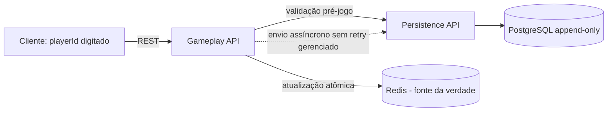

# MVP do jogo de senha — especificação técnica

> **Estado:** proposta documental. O código ainda não foi criado. As decisões e limitações abaixo refletem o escopo simplificado da MVP.

**Regras comuns:** payloads JSON UTF-8 quando indicado; timestamps ISO 8601 UTC gerados no serviço Gameplay. Senhas e palpites são strings de quatro algarismos distintos entre `0` e `9`, preservando zeros à esquerda.

## 1. Gameplay

### Responsabilidades e decisões da MVP

Gameplay controla a partida e usa Redis como **fonte da verdade durante a gameplay**. O serviço não consulta o PostgreSQL para responder ações ou consultas de partidas ativas. PostgreSQL recebe atualizações append-only assincronamente e tem consistência eventual.

A MVP não implementa login, sessão nem token. O cliente envia os IDs digitados pelos jogadores. O serviço valida a existência desses IDs na criação/entrada da partida, antes do início da gameplay. Durante uma partida ativa, operações usam o estado em cache e não consultam Persistência.

O jogador que cria a partida compartilha o `gameplayId` com o oponente por canal externo. O oponente digita o seu `playerId` e o `gameplayId` para entrar; não há fluxo de notificação de convite que aguarde aceite síncrono.

### Arquitetura



Java 21 / Spring Boot 3 e módulos Gameplay/Persistência são uma proposta de implementação, não código existente. As chamadas assíncronas não devem bloquear a thread que atende gameplay. Detalhes de transporte/armazenamento da fila assíncrona não constituem garantia da MVP.

### Modelo de chaves Redis

Por `gameplayId`, manter duas chaves, na mesma hash slot quando Redis Cluster exigir atomicidade entre elas:

- `{gameplayId}:presence`: heartbeat/timestamp mais recente e informação de timeout dos dois jogadores.
- `{gameplayId}:game`: estado atual e acumulativo da partida — IDs dos jogadores, estado de entrada/aceite/recusa, senhas escolhidas, palpites e resultados.

A atualização do estado relevante é atômica por partida. Partidas diferentes usam chaves independentes; não há lock global entre partidas. Palpites e resultados são acumulados na chave da gameplay durante a partida, e não substituídos pelo último palpite.

O estado na chave da partida é único/autoritativo durante gameplay. Não se define nesta MVP expiração, recuperação por replay ou reconstrução da partida perdida após falha do Redis.

### Contratos HTTP de Gameplay

Todas as rotas recebem `playerId` no caminho ou no corpo, pois não há identidade autenticada. Conhecer ou informar um `playerId` **não prova controle** sobre a conta; isso é limitação conhecida da MVP.

| Método e endpoint | Entrada | Saída de sucesso |
|---|---|---|
| `POST /games` | JSON: `playerId`, `opponentPlayerId` | `201 Created`: `gameplayId` e partida aguardando o oponente |
| `PATCH /games/{gameplayId}/players/{playerId}/join` | Sem corpo | `200 OK`: jogador ingressou; estado atualizado |
| `PATCH /games/{gameplayId}/players/{playerId}/decline` | Sem corpo | `200 OK`: partida marcada como recusada/encerrada |
| `PUT /games/{gameplayId}/players/{playerId}/secret` | JSON: `digits` | `200 OK`: confirmação e indicação se ambos definiram senha; nunca devolve a senha |
| `PATCH /games/{gameplayId}/players/{playerId}/heartbeat` | Sem corpo | `200 OK`: horário do servidor e estado de presença; timeout encerra a partida |
| `PUT /games/{gameplayId}/players/{playerId}/guess` | JSON: `digits` | `200 OK`: palpite registrado e contagens de corretos/parciais |
| `GET /games/{gameplayId}/state` | Sem corpo | `200 OK`: estado corrente e palpites/resultados visíveis na partida |
| `GET /internal/v1/players/{playerId}` | Sem corpo; rota entre serviços | `200 OK`: existência do ID; `404` se não existir |
| `POST /internal/v1/game-records` | JSON: atualização/snapshot append-only com timestamp Gameplay | `202 Accepted`: recebimento para gravação assíncrona |

> Os caminhos e DTOs abaixo estabelecem um contrato proposto para tornar explícito o fluxo de IDs manuais. Devem ser implementados e validados com o frontend; a documentação não representa rotas já implementadas.

#### Criar gameplay — `POST /games`

A criação verifica que `playerId` e `opponentPlayerId` existem. Como a checagem depende do módulo de Persistência, essa verificação ocorre somente na criação, antes da gameplay; falha temporária não deve ser interpretada como ID inexistente. O criador compartilha o identificador retornado com o oponente.

Entrada:

```json
{
  "playerId": "player-123",
  "opponentPlayerId": "player-456"
}
```

Saída (`201 Created`):

```json
{
  "gameplayId": "game-789",
  "status": "WAITING_FOR_OPPONENT",
  "playerIds": ["player-123", "player-456"],
  "createdAt": "2026-10-05T15:00:00Z"
}
```

#### Entrada ou recusa — `PATCH /games/{gameplayId}/players/{playerId}/join` e `/decline`

Sem corpo. O endpoint `join` identifica o participante pelo `playerId` da rota e valida que ele é o oponente esperado; a checagem de existência ocorre antes do estado `ACTIVE`, não a cada ação da partida. A rota `decline` também identifica o jogador pela rota. A MVP não prova criptograficamente a identidade alegada.

Saída de `join` (`200 OK`):

```json
{
  "gameplayId": "game-789",
  "status": "ACCEPTED",
  "playerId": "player-456",
  "updatedAt": "2026-10-05T15:01:00Z"
}
```

Saída de `decline` (`200 OK`):

```json
{
  "gameplayId": "game-789",
  "status": "DECLINED",
  "playerId": "player-456",
  "updatedAt": "2026-10-05T15:01:00Z"
}
```

#### Definir senha — `PUT /games/{gameplayId}/players/{playerId}/secret`

Entrada:

```json
{
  "digits": "0482"
}
```

Saída (`200 OK`):

```json
{
  "gameplayId": "game-789",
  "status": "ACTIVE",
  "playerId": "player-123",
  "ownSecretSet": true,
  "bothSecretsSet": true
}
```

A senha é gravada no estado autoritativo da partida, não é devolvida na resposta e não deve aparecer em logs. A partida passa a `ACTIVE` quando ambos os jogadores tiverem entrado e definido uma senha válida.

#### Heartbeat — `PATCH /games/{gameplayId}/players/{playerId}/heartbeat`

Sem corpo. Cada jogador envia um heartbeat por segundo. O servidor atualiza o timestamp ao recebê-lo e, após a atualização, verifica os dois jogadores. Para participante ainda sem timestamp, o instante de ativação da partida serve como referência inicial.

Se qualquer participante estiver sem heartbeat por **mais de 5 segundos**, a partida termina com status `FINISHED` e motivo `TIMEOUT`. Não há suspensão nem janela de reconexão nesta regra da MVP.

Saída sem timeout (`200 OK`):

```json
{
  "gameplayId": "game-789",
  "playerId": "player-123",
  "updatedAt": "2026-10-05T15:02:00Z",
  "status": "ACTIVE"
}
```

Saída quando o timeout é atingido (`200 OK`):

```json
{
  "gameplayId": "game-789",
  "playerId": "player-123",
  "updatedAt": "2026-10-05T15:02:00Z",
  "status": "FINISHED",
  "finishReason": "TIMEOUT"
}
```

A frequência corresponde a até **dois heartbeats por segundo por partida ativa**, antes das demais chamadas. Essa taxa deve ser considerada no dimensionamento; reduzir intervalo de heartbeat fica como evolução.

#### Enviar palpite — `PUT /games/{gameplayId}/players/{playerId}/guess`

Entrada:

```json
{
  "digits": "1234"
}
```

Saída (`200 OK`):

```json
{
  "gameplayId": "game-789",
  "playerId": "player-123",
  "guess": "1234",
  "result": {
    "correct": 1,
    "partial": 2
  },
  "status": "ACTIVE",
  "createdAt": "2026-10-05T15:03:00Z"
}
```

O backend valida o formato e calcula feedback usando a senha do oponente. Nesta MVP, a alternância de turnos e o bloqueio de chutes simultâneos ficam a cargo do frontend; o backend não promete serializar nem rejeitar duas submissões concorrentes por turno. Não há `requestId` nem garantia de idempotência de retry ponta a ponta.

#### Consultar estado — `GET /games/{gameplayId}/state`

Sem corpo. Lê exclusivamente a fonte autoritativa Redis durante a gameplay.

Saída (`200 OK`):

```json
{
  "gameplayId": "game-789",
  "status": "ACTIVE",
  "playerIds": ["player-123", "player-456"],
  "secretsSet": {
    "player-123": true,
    "player-456": true
  },
  "guesses": [
    {
      "playerId": "player-123",
      "digits": "1234",
      "result": {
        "correct": 1,
        "partial": 2
      },
      "createdAt": "2026-10-05T15:03:00Z"
    }
  ],
  "finishReason": null
}
```

A resposta nunca inclui as senhas. Sem autenticação, a proteção por jogador é apenas lógica e pode ser contornada; segredo em repouso e controle de acesso robusto são débitos de segurança.

### Concorrência e comportamento

- Atualizações de estado associadas à mesma partida são atômicas no Redis.
- Chaves específicas por gameplay isolam operações entre partidas; isso evita um lock global, mas não evita hot key nem contenção dentro de uma partida concorrente.
- O frontend controla o fluxo de turnos. Corridas, requests simultâneos ou retries podem gerar registros duplicados ou sequência de jogo inesperada; backend não oferece idempotência ponta a ponta na MVP.

## 2. Persistência

### Responsabilidade e consistência

Persistência confirma existência de IDs na inicialização/entrada, antes da partida ativa, e recebe atualizações do estado de forma assíncrona. PostgreSQL mantém registros append-only ordenados pelo timestamp emitido pelo componente Gameplay. O banco não é consultado para obter o estado de uma partida ativa; Redis é a fonte de verdade corrente e o banco é histórico eventualmente consistente.

A emissão assíncrona não bloqueia a thread de Gameplay. Na MVP não há garantia de durabilidade do canal intermediário, limite/tamanho de fila, polling, retry, replay, idempotência ponta a ponta ou reconciliação automatizada. Uma falha pode atrasar ou perder atualização histórica.

### Contratos HTTP de Persistência

| Método e endpoint | Entrada | Saída de sucesso |
|---|---|---|
| `GET /internal/v1/players/{playerId}` | Sem corpo | `200 OK`: `{ "playerId": "...", "exists": true }`; `404` se inexistente |
| `POST /internal/v1/game-records` | JSON: `gameplayId`, `gameplayTimestamp`, `recordType`, `state` | `202 Accepted`: aceito para gravação assíncrona; não representa garantia de gravação durável |

As rotas `/internal` são destinadas a comunicação entre serviços, mas a autenticação mútua/segurança forte entre serviços não é entregue na MVP e é débito técnico. A rota de verificação é usada antes de ativar uma partida, não a cada ação de gameplay.

#### Validar ID — `GET /internal/v1/players/{playerId}`

Sem corpo. Saída para ID existente (`200 OK`):

```json
{
  "playerId": "player-456",
  "exists": true
}
```

ID inexistente retorna `404 Not Found`. Uma falha ou timeout da consulta é erro de dependência e não deve ser interpretado como inexistência.

#### Receber atualização — `POST /internal/v1/game-records`

O componente Gameplay gera `gameplayTimestamp` ao produzir a atualização. O banco mantém versões históricas append-only; quando houver múltiplas atualizações para uma partida, a ordem histórica é determinada por esse timestamp. A MVP não adiciona identificador idempotente de evento nem sequência monotônica dedicada.

Entrada:

```json
{
  "gameplayId": "game-789",
  "gameplayTimestamp": "2026-10-05T15:03:00.123Z",
  "recordType": "GUESS_RECORDED",
  "state": {
    "status": "ACTIVE",
    "playerIds": ["player-123", "player-456"],
    "guesses": [
      {
        "playerId": "player-123",
        "digits": "1234",
        "result": {
          "correct": 1,
          "partial": 2
        }
      }
    ]
  }
}
```

Resposta (`202 Accepted`):

```json
{
  "gameplayId": "game-789",
  "accepted": true,
  "receivedAt": "2026-10-05T15:03:00.130Z"
}
```

`202` confirma aceitação para processamento, não commit durável no PostgreSQL. O mecanismo de fila/processamento, retenção dos pendentes e comportamento após falha ainda não são garantidos na MVP.

### Modelo de dados proposto

- `players`: IDs já cadastrados e campos necessários à validação de existência. A origem e o fluxo prévio de cadastro são externos ao escopo desta documentação.
- `game_records`: chave primária interna do banco, `gameplay_id`, `gameplay_timestamp`, `record_type` e `state` (por exemplo, `JSONB`). Registros são append-only; não são atualizados para simular o estado atual.
- Senhas não devem ser retornadas em APIs de leitura ou expostas em logs. Proteção de segredos em repouso e autorização robusta são riscos/debitos da MVP a serem tratados antes de dados reais sensíveis.

### Persistência assíncrona, latência e ordem

Falhas ou lentidão da persistência não devem prender a thread que atende a gameplay; o cliente continua usando o estado em Redis. A consulta de existência do jogador é exceção pré-jogo e pode adicionar latência à criação/entrada. Durante uma sessão ativa não se consulta o banco.

O timestamp vem do componente Gameplay e define a ordem pretendida dos registros no banco. Igualdade de timestamps, múltiplas instâncias com relógios diferentes, reordenação de chegada, duplicatas, perda na fila e ausência de idempotência permanecem riscos aceitos; não há garantia técnica de ordenação total apenas com timestamp.

### Stack e implantação

Java 21 / Spring Boot e separação lógica Gameplay/Persistência são propostas de implementação. Redis e PostgreSQL são os armazenamentos previstos. Parâmetros de durabilidade, redundância, failover, rede e serviço cloud não são garantidos aqui. A MVP aceita falha/perda de dados do Redis como débito técnico.

## Débitos técnicos da MVP

1. **Autenticação/autorização:** sem login, sessão ou token; IDs digitados podem ser falsificados.
2. **Resiliência da persistência assíncrona:** sem gestão de fila/outbox, polling, retry, limite de pendências ou confirmação durável; atualizações podem ser perdidas.
3. **Idempotência e ordenação:** sem idempotência ponta a ponta/ID de evento e sem sequência monotônica; timestamps podem empatar ou divergir entre instâncias.
4. **Durabilidade/recuperação do cache:** configuração padrão, aceitação de perda quando Redis falha e ausência de replay/reconstrução da partida.
5. **Concorrência/turnos:** alternância controlada pelo frontend; backend pode receber palpites simultâneos e não oferece idempotência para retries.
6. **Escala do estado:** lista de palpites/resultados cresce dentro de uma única chave por partida; pressão de memória e hot key não são gerenciadas na MVP.
7. **Disponibilidade e capacidade:** falhas de zona/região e limites do Redis, PostgreSQL e serviços são aceitos sem SLO, RTO/RPO ou teste de carga.
8. **Segurança de serviços e segredos:** sem proteção forte de rotas internas, autorização confiável por participante ou configuração abrangente de segredos/cifra.
9. **Contratos e observabilidade:** sem versionamento/OpenAPI/Swagger; observabilidade limitada a logs da aplicação.
10. **Testes e mecanismos de resiliência:** somente testes unitários e integrados; circuit breaker, retry, timeout/fallback abrangentes e testes de falha ficam para depois.

## Referências AWS

A escolha de produto/serviço AWS, alta disponibilidade, durabilidade, backup e recuperação deve ser definida em uma etapa futura; esta MVP não declara garantias gerenciadas Multi-AZ ou recuperação regional.
