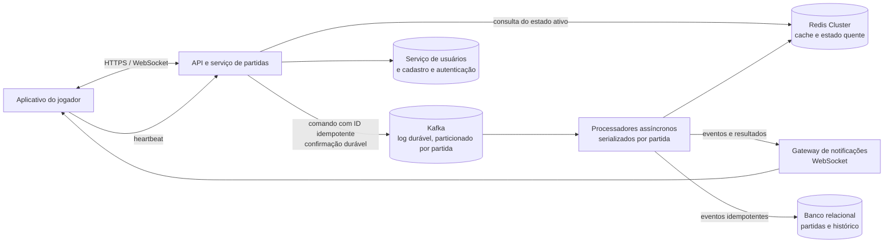

# Jogo de senha — regras e arquitetura de back-end

## 1. Como funciona o jogo

- Cada partida tem **dois jogadores cadastrados** e autenticados.
- Cada jogador escolhe secretamente uma senha de **4 algarismos distintos**, de 0 a 9 (por exemplo, `4820`; `4492` é inválida).
- Os jogadores alternam os turnos e enviam palpites de quatro algarismos válidos contra a senha do adversário.
- Para cada palpite, o servidor calcula:
  - **Corretos:** algarismos que coincidem também na posição.
  - **Parciais:** algarismos presentes na senha adversária, mas em outra posição.
- O autor do palpite recebe a contagem como feedback. O adversário recebe o palpite e a mesma contagem.
- A partida termina quando um jogador acerta os quatro algarismos nas posições corretas. Senhas e estado da partida não são expostos além do feedback previsto.

## 2. Desenho da arquitetura

## 3. Componentes e justificativas

- **API e WebSocket:** autentica o usuário, recebe ações e distribui feedback em tempo real. O serviço pode ter várias instâncias, sem manter a sessão exclusivamente na memória local.
- **Redis Cluster:** mantém o estado ativo para respostas rápidas: turno, palpites, presença, prazo de reconexão e progresso. Os processadores são os únicos escritores; aplicam transições atomicamente e em ordem por `matchId`. O cache pode ser reconstruído a partir dos eventos persistidos.
- **Kafka:** recebe comandos/eventos com confirmação durável antes do processamento e os ordena por partição de partida. Separa a entrada rápida das gravações e projeções confiáveis, além de permitir reprocessamento após falhas.
- **Processadores assíncronos:** atualizam o estado quente, geram notificações e persistem o histórico. A deduplicação por identificador de evento/comando e restrições únicas no banco tornam as operações **idempotentes**: reentregas não duplicam jogadas ou registros.
- **Banco relacional:** registro durável de partidas, eventos e resultados; permite recuperar uma partida e reconstruir seu estado após perda ou reinício do cache.
- **Cadastro e autenticação:** impedem que usuários não cadastrados participem e associam cada ação ao jogador correto.

### Presença, reconexão e partições

O cliente envia heartbeats. Se eles cessarem, a partida fica **suspensa durante um período de tolerância**; uma reconexão nesse intervalo restaura o jogo. Ao expirar o prazo, a partida é encerrada conforme a regra de produto definida (por exemplo, desistência do desconectado). A presença é temporária e expira automaticamente. A API confirma o recebimento após a gravação durável do comando; o feedback do palpite é enviado quando o processador aplica a jogada e calcula o resultado.

Para evitar jogadas concorrentes ou divergentes em múltiplas instâncias, comandos são ordenados por partida e o Redis aplica cada transição atomicamente. Em uma partição de rede, apenas o lado com autoridade/quórum para a partida deve aceitar escrita; o lado sem autoridade deve recusar temporariamente ações, priorizando consistência sobre disponibilidade. Assim não há dois estados válidos para a mesma partida.

> **Premissas adotadas:** turnos alternados; senha com algarismos distintos; reconexão permitida apenas durante o prazo de tolerância. O prazo e a consequência exata de sua expiração ficam como parâmetros de produto.
