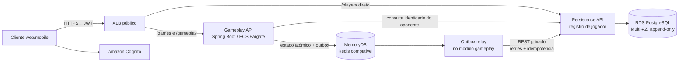

# MVP do jogo de senha — especificação técnica

## 1. Resumo da solução

**Stack escolhida:** Java 21, Spring Boot 3 e Gradle multi-módulo. O projeto contém os módulos `gameplay` e `persistence`; podem ser executados juntos ou como serviços separados, mantendo comunicação REST.

**Cloud: AWS** — ECS/Fargate para os módulos, ALB para roteamento HTTPS, Amazon MemoryDB compatível com Redis OSS para estado ativo e outbox, Amazon RDS for PostgreSQL Multi-AZ para histórico, Cognito para identidade/JWT, Secrets Manager/KMS para segredos e CloudWatch para observabilidade.

## 2. Arquitetura



O cadastro do jogador é roteado pelo ALB **diretamente ao módulo de persistência**, não pelo gameplay. Gameplay gerencia o estado operacional da partida no Redis; a outbox replica assincronamente o ciclo da partida ao PostgreSQL. Em deploy conjunto os módulos podem compartilhar um artefato; em deploy separado cada um roda como serviço ECS, sem mudar os contratos REST.

## 3. Endpoints

Todas as rotas de usuário exigem JWT do Cognito. `playerId` precisa corresponder ao `sub` autenticado. Chamadas entre módulos usam autenticação de serviço; endpoints `/internal` não são públicos.

| Módulo | Endpoint | Responsabilidade |
|---|---|---|
| Persistência | `POST /players` | Cadastro único. Cria perfil para o `sub` autenticado; chamadas repetidas retornam o perfil existente, sem duplicá-lo. |
| Persistência | `GET /internal/v1/players/{playerId}` | Confirmar a existência do jogador alvo para gameplay. Uso interno. |
| Gameplay | `POST /games/invitations` | Abrir partida/convite; corpo contém o ID do jogador convidado. Retorna `gameplayId` e status `PENDING`. |
| Gameplay | `GET /games/invitations?status=pending` | Listar convites pendentes do jogador autenticado, via polling REST. |
| Gameplay | `POST /games/{gameplayId}/accept` | O convidado aceita; transição atômica para `ACCEPTED`. |
| Gameplay | `POST /games/{gameplayId}/decline` | O convidado recusa; transição atômica para `DECLINED`. |
| Gameplay | `PUT /games/{gameplayId}/secret` | Definir a própria senha após aceite: quatro algarismos distintos. A partida inicia quando ambos definirem. |
| Gameplay | `POST /gameplay/{gameplayId}/{playerId}` | Heartbeat a cada 500 ms; retorna `updated-at`, `gameplay-online` e `suspended`. |
| Gameplay | `POST /gameplay/{gameplayId}/{playerId}/guesses` | Enviar palpite; recebe `requestId` para deduplicar retries. Retorna contagem de corretos/parciais ao autor. |
| Gameplay | `GET /gameplay/{gameplayId}/{playerId}/updates?afterSequence=N` | Buscar palpites e feedbacks novos do adversário; substitui WebSocket por polling. |
| Gameplay | `GET /gameplay/{gameplayId}/{playerId}/state` | Consultar estado visível e retomar a partida. |
| Persistência | `POST /internal/v1/game-records` | Receber evento/snapshot do ciclo da partida; idempotente por `eventId`. |
| Persistência | `GET /internal/v1/games/{gameplayId}/latest` | Obter o snapshot mais recente para recuperação do cache. |

A consulta do convidado usa polling REST; nenhuma notificação depende de WebSocket. Se o jogador-alvo não existir, o convite é rejeitado. Gameplay pode manter em Redis um cache de IDs confirmados; em cache miss consulta a Persistência API.

## 4. Ciclo e estados da partida

1. O jogador autenticado abre convite para um `playerId` existente. Gameplay cria a partida no Redis como `PENDING` e registra `INVITATION_OPENED` na outbox.
2. O convidado consulta pendências e decide. Gameplay valida que é o convidado designado e, atomicamente, muda para `ACCEPTED` ou `DECLINED`, registrando `INVITATION_ACCEPTED` ou `INVITATION_DECLINED`.
3. Após aceite, cada jogador define sua senha. Quando ambas estão definidas, o estado passa a `ACTIVE`.
4. Durante o jogo, heartbeat, palpites e resultados atualizam o estado no Redis e acrescentam eventos/snapshots à outbox. Suspensão, retomada e encerramento também são transições persistidas.

Estados principais: `PENDING`, `ACCEPTED`, `DECLINED`, `ACTIVE`, `SUSPENDED` e `FINISHED`. Uma recusa ou encerramento não apaga o histórico. Convite, decisão e estado atual ficam imediatamente no componente gameplay (Redis); sua cópia confiável é enviada ao banco assincronamente.

### Cache e atomicidade

Chaves por partida (com *hash tag* comum no Redis Cluster):

- `{gameplayId}:state`: participantes, status, turno, senhas protegidas, palpites e resultado.
- `{gameplayId}:presence`: hash `playerId → lastSeenEpochMillis`.
- `{gameplayId}:timeout`: contador de tolerância.
- `{gameplayId}:sequence`: sequência monotônica dos eventos.
- `{gameplayId}:outbox`: Redis Stream com eventos ainda não confirmados pela persistência.

Cada mudança valida o estado anterior e atualiza estado, sequência e outbox atomicamente (script Lua/transação Redis). Assim duas instâncias não aceitam, por exemplo, aceite e recusa simultâneos para o mesmo convite. O estado suspenso/recusado/finalizado permanece verificável; apagar presença não apaga o status terminal.

**Timeout a confirmar:** a regra recebida zera o contador quando algum jogador está sem heartbeat há mais de 5 s, mas incrementa quando nenhum está atrasado. Literalmente, isso pode suspender uma partida online após três chamadas e não contar a ausência. Também não foi definido o payload do ramo que zera o contador. `PresencePolicy` encapsula a regra, que deve ser confirmada antes da implementação.

## 5. Persistência confiável

Cadastro e estado de partida têm caminhos diferentes:

- **Jogador:** `POST /players` grava diretamente no PostgreSQL por meio do módulo de persistência. `cognito_subject` tem restrição única; uma repetição devolve o perfil já criado.
- **Partida:** gameplay registra cada mudança no Redis/outbox primeiro e responde ao jogador sem esperar o banco. O relay envia por REST e só confirma o evento após a resposta persistida. Se REST/DB estiver indisponível, mantém a outbox e reenvia com backoff. Não há Kafka.

PostgreSQL é append-only para partidas. Uma tabela `players` contém `player_id`, `cognito_subject`, `created_at` e nome público. `game_records` contém `event_id` (PK), `gameplay_id`, `sequence`, `event_type`, `actor_player_id`, `recorded_at` e `snapshot` (JSONB). Registra abertura, aceite/recusa, senhas, palpites, feedbacks, heartbeats e transições de estado. Restrições únicas em `event_id` e `(gameplay_id, sequence)` tornam retries idempotentes e preservam ordem; o maior `sequence` válido é a visão atual. Senhas são criptografadas em repouso e nunca devolvidas ao oponente nem escritas em logs.

MemoryDB é configurado com durabilidade e replicação Multi-AZ. Redis/outbox mantém estado quente e eventos pendentes; PostgreSQL conserva o histórico confiável. Se o estado quente precisar ser reconstruído, gameplay carrega o último snapshot persistido e reaplica eventos ainda pendentes.

## 6. Fluxos entre classes

### Cadastro único

`Cognito` autentica → ALB encaminha `POST /players` diretamente à `PlayerController` do módulo persistence → `PlayerRegistrationService.registerOnce` procura/inclui por `cognito_subject` → `PlayerRepository` grava uma única linha → retorna o mesmo `playerId` em chamadas seguintes.

### Convite, resposta e replicação

`GameplayController.openInvitation` → `InvitationApplicationService.open` valida o chamador e o jogador alvo → `RedisGameRepository.createInvitationAtomically` grava status `PENDING`, sequência e evento outbox → resposta ao chamador. O convidado consulta pendências e chama `accept` ou `decline`; `GameLifecycleService` verifica identidade e status e faz a transição atômica. `OutboxRelay` envia os eventos por `PersistenceRestClient`; `PersistGameRecordService.appendIdempotently` grava em transação PostgreSQL e reconhece duplicatas por `eventId`.

### Palpite e presença

`GuessApplicationService.submitGuess` valida partida `ACTIVE`, turno, quatro dígitos distintos e `requestId`; `GuessEvaluator.evaluate` calcula corretos/parciais; Redis grava a jogada e evento atomicamente. O autor recebe feedback e o adversário consulta `/updates`. `HeartbeatApplicationService.receiveHeartbeat` chama `PresencePolicy.evaluatePresence` e atualiza timestamp/timeout atomicamente. Todos os eventos seguem a mesma outbox para persistência.

## 7. Classes/objetos

### Módulo `gameplay`

| Classe/objeto | Responsabilidade e métodos principais |
|---|---|
| `GameplayController` | `openInvitation`, `listInvitations`, `acceptInvitation`, `declineInvitation`, `setSecret`, `heartbeat`, `submitGuess`, `getUpdates`, `getState`. |
| `InvitationApplicationService` | `open`, `accept`, `decline`; controla participantes e fluxo de convite. |
| `GameLifecycleService` | `setSecret`, `startWhenReady`, `suspend`, `resume`, `finish`; transições válidas de estado. |
| `RegisteredPlayerClient` | `findPlayer`; verifica jogador alvo via REST/cache de IDs. |
| `HeartbeatApplicationService` / `PresencePolicy` | `receiveHeartbeat` / `evaluatePresence`; grava presença e decide online/suspensão. |
| `GuessApplicationService` / `GuessEvaluator` | `submitGuess` / `evaluate`; validam chute e calculam feedback. |
| `RedisGameRepository` | `createInvitationAtomically`, `applyDecisionAtomically`, `applyGuessAtomically`, `applyHeartbeatAtomically`, `loadState`, `loadUpdates`, `appendOutbox`. |
| `OutboxRelay` / `PersistenceRestClient` | `publishPending`, `acknowledge`, `retry`; `postGameRecord`, `getLatestGameRecord`. |
| `GameRecoveryService` | `recoverGame`; carrega snapshot persistido e restaura estado ativo/outbox. |

### Módulo `persistence`

| Classe/objeto | Responsabilidade e métodos principais |
|---|---|
| `PlayerController` | `registerPlayer`; endpoint público de cadastro, roteado diretamente à persistência. |
| `PlayerRegistrationService` | `registerOnce`; garante cadastro único por identidade Cognito. |
| `PlayerRepository` | `insertIfAbsent`, `findByCognitoSubject`, `findByPlayerId`. |
| `PersistenceController` | `appendGameRecord`, `getLatestGameRecord`, `getPlayer`. |
| `PersistGameRecordService` | `appendIdempotently`; valida identidade/sequence e grava sem alterar eventos anteriores. |
| `GameRecordRepository` | `insertIfAbsent`, `findLatestByGameId`; grava/consulta snapshots append-only. |

Objetos de domínio/contrato: `Player`, `GameInvitation`, `GameState`, `SecretCode`, `Guess`, `GuessResult`, `PlayerPresence`, `GameRecord` e DTOs REST. `GameRecord` contém `eventId`, `gameplayId`, `sequence`, tipo, horário e snapshot.

## 8. Estrutura de pastas proposta

```text
project-root/
├── mvp/
│   └── tech-docs/
│       └── arquitetura-tecnica-mvp.md
└── backend/                         # Gradle multi-módulo
    ├── settings.gradle
    ├── build.gradle
    ├── gameplay-app/
    │   └── src/main/java/.../gameplay/
    │       ├── api/
    │       ├── application/
    │       ├── domain/
    │       ├── infrastructure/      # Redis, Cognito, REST client
    │       └── config/
    ├── persistence-app/
    │   └── src/main/java/.../persistence/
    │       ├── api/
    │       ├── application/
    │       ├── domain/
    │       ├── infrastructure/      # JPA, migrations, auth
    │       └── config/
    ├── shared-contracts/             # DTOs/versionamento REST
    └── infra/                        # ECS, ALB, MemoryDB, RDS, IAM
```

É uma proposta documental, não código criado. O mesmo projeto permite empacotar gameplay e persistência juntos ou publicar cada app como serviço ECS separado.

## 9. Consistência, disponibilidade e CAP

Gameplay prioriza disponibilidade quando a persistência REST/DB está indisponível: mantém estado e outbox em MemoryDB e replica depois. Para uma partição do próprio Redis que impeça autoridade única por partida, rejeita escrita conflitante em vez de criar dois estados. Persistência prioriza consistência dos registros; não se promete CA durante partições. A convergência posterior usa retries idempotentes e sequência por partida.

## Referências AWS

- [ECS com AWS Fargate](https://docs.aws.amazon.com/AmazonECS/latest/developerguide/AWS_Fargate.html)
- [Amazon MemoryDB](https://docs.aws.amazon.com/memorydb/latest/devguide/what-is-memorydb.html)
- [Clusters Multi-AZ do Amazon RDS](https://docs.aws.amazon.com/AmazonRDS/latest/UserGuide/multi-az-db-clusters-concepts.html)
